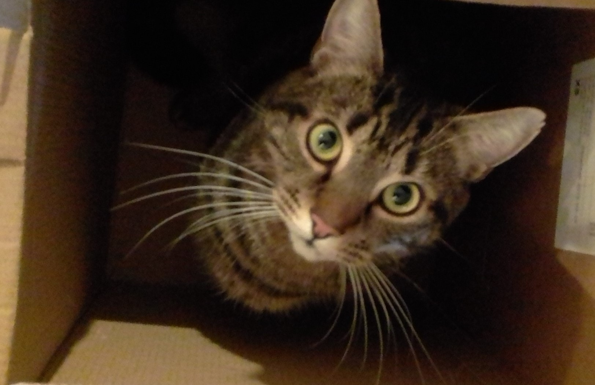

# Daniel Yates
#### Final Year Computer Science Student at the University of the West of England
#### Darkmode, Mindfulness, Cat, and Food Lover

#### Constantly improving at my craft

- 🔭 I’m currently working on my [Final Year Project](https://github.com/yatesytea/dsptrain), and [Enterprise Systems Development](https://github.com/yatsesytea/esd8smartcare)
- 🌱 I’m currently learning Django, Pandas, and other Python Frameworks.
- 💬 Ask me about any Data Analysis, and Python Job opportunities.
- 📫 How to reach me: [danyates1997@googlemail.com](danyates1997@googlemail.com)

Here's a Cat:

